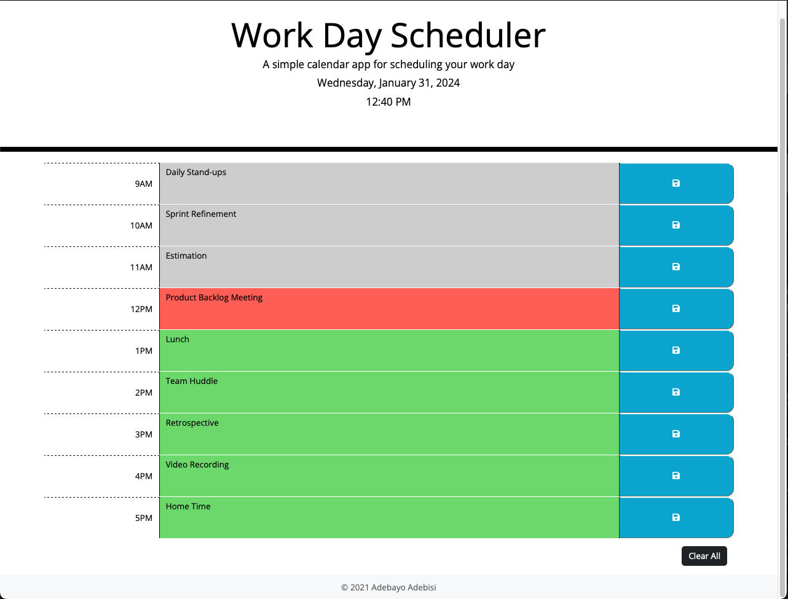
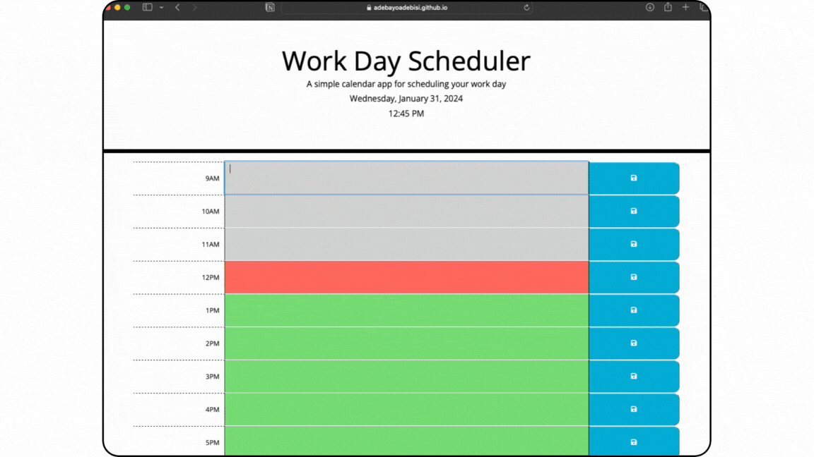

# 07 Work Day Scheduler Challenge

# Work Day Scheduler Application

## Description
This activity required the creation a simple calendar application that allows a user to save events for each hour of the day. The app will run in the browser, and will feature dynamically updated HTML and CSS powered by JavaScript code. It will have a clean and polished user interface that is responsive, ensuring that it adapts to multiple screen sizes even for sizes.


## User Story
```md
AS AN employee with a busy schedule
I WANT to add important events to a daily planner
SO THAT I can manage my time effectively.
```
## Acceptance Criteria
- GIVEN a user opens the planner,
- WHEN the app is loaded,
- THEN the current day and time should be displayed at the top of the calendar.

- GIVEN a user is viewing the planner,
- WHEN the user scrolls down,
- THEN  timeblocks for standard business hours should be presented.

- GIVEN a user is viewing a timeblock in the planner,
- WHEN the timeblock is viewed,
- THEN  it should be color-coded based on whether it is in the past, present, or future.

- GIVEN a user clicks on a timeblock,
- WHEN the user clicks on a timeblock description,
- THEN  they should be able to enter an event for that timeblock.

- GIVEN a user has entered an event in a timeblock,
- WHEN the user clicks the save button in that timeblock,
- THEN  the event should be saved in local storage.

- GIVEN a user refreshes the page,
- WHEN the page is refreshed,
- THEN  the events entered by the user should persist between refreshes.

- GIVEN a user clicks on the clear all button,
- WHEN the user wants to clear the description,
- THEN  they should be able to clear all the timeblock entries.
> **Note** This is an extra addition to allow the user to start afresh every working day.

## Password Generator Application
The following images shows the Work Day Scheduler displaying a working application.



> **Note** This is a screenshot of the deployed Password Generator.



> **Note** This is a video of the Password Generator showing all the required criteria.

## References
[Day.js - Format](https://day.js.org/docs/en/display/format)

[W3 Schools - Tutorials](https://www.w3schools.com/jquery/default.asp)

## License
Licensed under the MIT License

## GitHub Repository
URL: https://github.com/adebayoadebisi/07-work-day-scheduler-challenge

## Deployed Web Application
URL: https://adebayoadebisi.github.io/07-work-day-scheduler-challenge/
